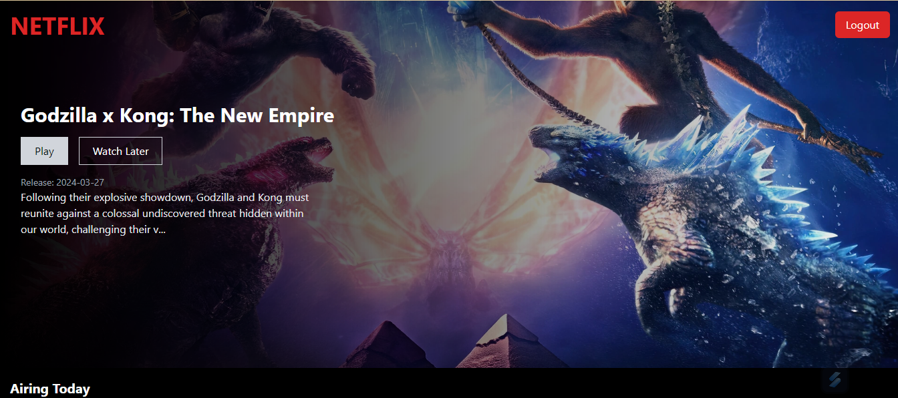
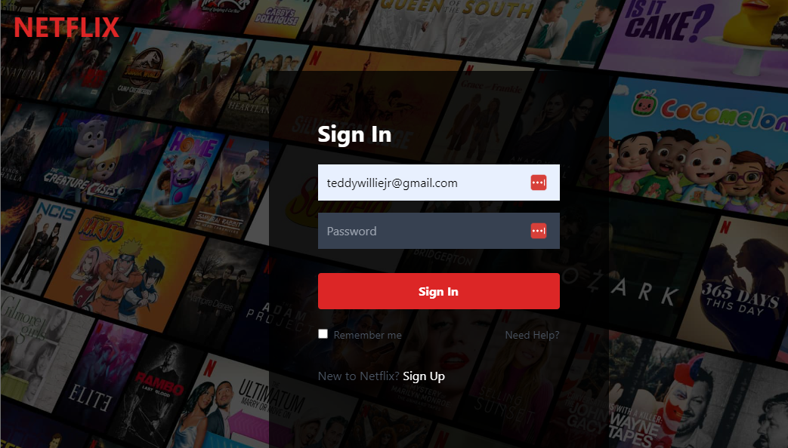

# React Netflix Clone
A responsive Netflix clone app built with React, Tailwind CSS and Firebase. The app allows users to browse movies and TV shows data from The Movie DB API, and add items to their watchlist. User authentication is handled with Firebase Auth and data is stored in Firebase Firestore database.

## Key Features
- Browse popular and top rated movies and - TV shows
- Search movies and shows by title
- View movie/show details including overview, ratings, trailers and similar items
- Add/remove movies/shows to a personalized watchlist
- Responsive design adapts to different screen sizes
- Authentication with email/password login and registration
- Persistent user watchlist data with Firebase

## Tech Stack

### Frontend

- React - JS library
- Tailwind CSS - Utility-first CSS framework
- React Router - Routing library
- React Icon - Icons component library

### Backend

- Firebase - Authentication, Database
- The Movie DB API - Movies/TV data

## Getting Started

- Clone/download the repo
- Run npm install to install dependencies
- Create a Firebase project and add config details
- Get an API key from TMDB and add to .env file
- Run npm start to start the local dev server
- Sign up/login to use full features

